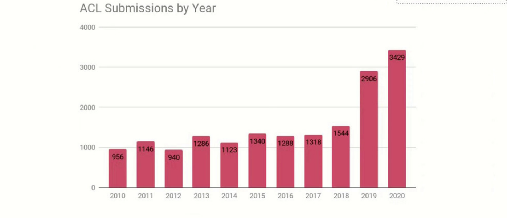
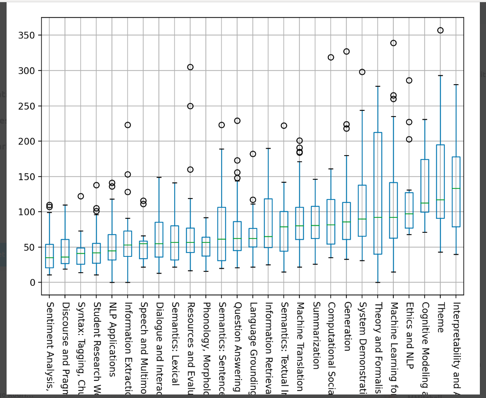

# ACL 2020

### Selections from ACL 2020

This contains a selection** of papers from  ACL 2020. For a more complete list of papers organized by topic, see [here](https://github.com/roomylee/ACL-2020-Papers/blob/master/papers_with_arxiv_link_topic.md). The full list of papers (in both the main conference and in workshops) can be found [here](https://www.aclweb.org/anthology/events/acl-2020/). The full proceedings, organized by track, are in this [giant pdf](https://www.aclweb.org/anthology/2020.acl-main.pdf).

I also enjoyed reading [Vered Shwartz's highlights of ACL 2020](https://medium.com/@vered1986/highlights-of-acl-2020-4ef9f27a4f0c), as well as [Yoav Goldberg's thoughts on the format of ACL 2020](https://medium.com/@yoav.goldberg/the-missing-pieces-in-virtual-acl-a05327cf9a18) (in particular that the virtual format makes free-form converations, socializing, meeting people, and generating ideas very difficult).

** NOTE: Some areas (Dialogue, Question Answering, Machine Translation, Language Grounding, Multilingual/cross-lingual Tasks, and Syntax) are not well-represented in this list.

- [General Remarks](#general-remarks)
- [Tutorials](#tutorials)
- [Birds of a feather](#birds-of-a-feather)
- [Workshops](#workshops)
- [Keynotes](#keynotes)
- [System Demonstrations](#system-demonstrations)
- [Topics](#topics)
  - :boom: [Methodological](#top-methodological)
  - :boom: [Theme papers](#top-theme-papers)
  - [New Datasets](#top-new-datasets)
  - [Integrating text with other kinds of data](#top-integrating-text-with-other-kinds-of-data)
  - [Semantics](#top-semantics)
  - [Discourse](#top-discourse)
  - :boom: [Explainability](#top-explainability)
  - [Learning with Less Data](#top-learning-with-less-data)
  - [Language Models and Transformers](#top-language-models-and-transformers)
  - [Embeddings](#top-embeddings)
  - [Cognitive Models and Psycholinguistics](#top-cognitive-models-and-psycholinguistics)
- [NLG papers](#nlg-papers)
  - [Dialogue](#top-dialogue)
  - [Text Generation](#top-text-generation)
  - [Data-to-Text Generation](#top-data-to-text-generation)
  - [Summarization and Simplification](#top-summarization-and-simplification)
  - [Machine Translation](#top-machine-translation)
  - [Style Transfer](#top-style-transfer)
- [NLU papers](#nlu-papers)
  - [Text Classification](#top-text-classification)
  - [Topic Models](#top-topic-models)
  - [Knowledge Graphs](#top-knowledge-graphs)
  - [Hypernymy Detection](#top-hypernymy-detection)
  - [Natural Language Inference](#top-natural-language-inference)
  - [Emergent Language in Multi-Agent Communication](#top-emergent-language-in-multi-agent-communication)
- [Applications](#top-applications)
- [Other](#top-other)

---
---

## [General Remarks](#selections-from-acl-2020)

**Four new tracks this year:**

- Ethics and NLP (44)
- Interpretation and Analysis of Models for NLP (95)
- Theory and Formalism in NLP (Linguistic and Mathematical) (12)
- Theme: Taking Stock of Where We've Been and Where We're Going (65)

**The number of submissions was over double those of ACL 2018:**

**Popular topics:**

- ACL 2020 paper keyword statistics: https://github.com/roomylee/ACL-2020-Papers  (top keywords: generation, **translation**, **dialogue**, graph, extraction). 
- The six most popular tracks (by number of papers accepted) according to https://acl2020.org/blog/general-conference-statistics/: 
  - Machine Translation
  - Machine Learning for NLP
  - Dialogue and Interactive Technologies
  - Information Extraction
  - Generation
  - NLP Applications

Interestingly, these don't correspond to the number of views per paper. Yoav Goldberg made a box-plot for the number of views each video received:

  
     
    <em> Box-plot for number of video views in each track. Image from https://twitter.com/yoavgo/status/1282459579339681792</em>

Although there were far fewer *Theme*, *Interpretability*, *Cognitive Modeling* and *Ethics* papers, these had the highest number of views. On the other hand, *Information Extraction*, *NLP Applications*, and *Dialogue and Interactive Systems* papers had very few views. 

Sadly, Discourse and Pragmatics had both few submissions and few views (despite Bonnie Webber winning the lifetime achievement award).

---
---

## [Tutorials](#selections-from-acl-2020)

- [**T1: Interpretability and Analysis in Neural NLP**](https://virtual.acl2020.org/tutorial_T1.html) [**(slides)**](https://sebastiangehrmann.com/assets/files/acl_2020_interpretability_tutorial.pdf) [**(slides and video)**](https://slideslive.com/38928626/interpretability-and-analysis-in-neural-nlp)
- [T2: Multi-modal Information Extraction from Text, Semi-structured, and Tabular Data on the Web](https://slideslive.com/38931662/t2-multimodal-information-extraction-from-text-semistructured-and-tabular-data-on-the-web) [**(slides)**](https://sites.google.com/view/acl-2020-multi-modal-ie)
- [T3: Reviewing Natural Language Processing Research](https://virtual.acl2020.org/tutorial_T3.html)  [**(slides)**](https://github.com/reviewingNLP/ACL2020T3material) [**(slides and video)**](https://slideslive.com/38928627/reviewing-natural-language-processing-research)
- [**T4: Stylized Text Generation: Approaches and Applications**](https://virtual.acl2020.org/tutorial_T4.html) [**(slides and video)**](https://slideslive.com/38928628/stylized-text-generation-approaches-and-applications)
- [T5: Achieving Common Ground in Multi-modal Dialogue](https://virtual.acl2020.org/tutorial_T5.html)  [**(slides and video)**](https://slideslive.com/38928631/achieving-common-ground-in-multimodal-dialogue)
- [**T6: Commonsense Reasoning for Natural Language Processing**](https://virtual.acl2020.org/tutorial_T6.html) [**(slides and video)**](https://slideslive.com/38931667/t6-commonsense-reasoning-for-natural-language-processing) [**(website)**](https://homes.cs.washington.edu/~msap/acl2020-commonsense/)
- [T7: Integrating Ethics into the NLP Curriculum](https://virtual.acl2020.org/tutorial_T7.html) [**(slides)**](https://virtual.acl2020.org/static/pdf/T7-Slides.pdf)
- [T8: Open-Domain Question Answering](https://virtual.acl2020.org/tutorial_T8.html)  [**(slides and video)**](https://slideslive.com/38931668/t8-opendomain-question-answering) [**(website)**](https://github.com/danqi/acl2020-openqa-tutorial)

---
---

## [Birds of a feather](#selections-from-acl-2020)

Unfortunately many of these sessions were scheduled at the same time, so I missed many interesting sessions: Lexical Semantics, Summarization, Information Retrieval & Text Mining, Interpretability, Language Grounding, and NLP Applications.

There were some interesting discussions in Discourse and Pragmatics, Information Extraction, and Generation (with over a hundred people in the Generation session!) Unfortunately the Zoom format with large numbers of people is not conducive to fluid converations between participants; these were mostly QA with the host. It was good to hear some established researchers express a desire to move beyond the current "pre-training on huge datasets and fine-tuning" kind of NLP.

---
---

## [Workshops](#selections-from-acl-2020)

Full list of workshops: https://acl2020.org/program/workshops/

- [W5: FEVER 3](https://fever.ai/workshop.html) [**(papers)**](https://www.aclweb.org/anthology/volumes/2020.fever-1/)
  - Maintaining Quality in FEVER Annotation  [**(paper)**](https://www.aclweb.org/anthology/2020.fever-1.6.pdf)
  > "Annotations in the FEVER fact-checking dataset aren't riddled with superficial shortcuts like those Niven&Kao found elsewhere.". TO FIND OUT: what about https://arxiv.org/pdf/1908.05267.pdf ?
- [W7: The Second Workshop on Figurative Language Processing](https://sites.google.com/view/figlang2020/) [**(papers)**](https://www.aclweb.org/anthology/volumes/2020.figlang-1/)
- [W8: NUSE (Workshop on Narrative Understanding, Storylines, and Events)](https://sites.google.com/view/nuse) [**(papers)**](https://www.aclweb.org/anthology/volumes/2020.nuse-1/)
- [W10: 5th Workshop on Representation Learning for NLP](https://sites.google.com/view/repl4nlp2020/home) [**(papers)**](https://www.aclweb.org/anthology/volumes/2020.repl4nlp-1/)
- [W20: NLPCovid](https://www.nlpcovid19workshop.org/)
- [WNGT (The 4th Workshop on Neural Generation and Translation)](https://sites.google.com/view/wngt20/home) [**(papers)**](https://www.aclweb.org/anthology/volumes/2020.ngt-1/)

And two multi-modal workshops:

- [ALVR (Workshop on Advances in Language and Vision Research)](https://alvr-workshop.github.io/) [**(papers)**](https://www.aclweb.org/anthology/events/acl-2020/#2020-alvr-1)
- [The Second Grand-Challenge and Workshop on Human Multimodal Language](http://multicomp.cs.cmu.edu/acl2020multimodalworkshop/) [**(papers)**](https://www.aclweb.org/anthology/volumes/2020.challengehml-1/)

---
---

## [Keynotes](#selections-from-acl-2020)

- [Kathleen R. McKeown, Rewriting the Past: Assessing the Field through the Lens of Language Generation](https://virtual.acl2020.org/plenary_session_keynote_kathy_mckeown.html)
>
>
- [Josh Tenenbaum, Cognitive and computational building blocks for more human-like language in machines](https://virtual.acl2020.org/plenary_session_keynote_josh_tenenbaum.html)
>
>

---
---

## [System Demonstrations](#selections-from-acl-2020)

---
---

## [Topics](#selections-from-acl-2020)

### [:top:](#selections-from-acl-2020) Methodological

:boom: [Beyond Accuracy: Behavioral Testing of NLP Models with CheckList](https://virtual.acl2020.org/paper_main.442.html) (best paper) [**(paper)**](https://www.aclweb.org/anthology/2020.acl-main.442.pdf) [**(code)**](https://github.com/marcotcr/checklist)

:heavy_minus_sign: [Not All Claims are Created Equal: Choosing the Right Statistical Approach to Assess Hypotheses](https://virtual.acl2020.org/paper_main.506.html) [**(paper)**](https://www.aclweb.org/anthology/2020.acl-main.506.pdf) [**(code)**](https://github.com/allenai/HyBayes)

### [:top:](#selections-from-acl-2020) Theme Papers

:boom: [(Re)construing Meaning in NLP](https://virtual.acl2020.org/paper_main.462.html) [**(paper)**](https://www.aclweb.org/anthology/2020.acl-main.462.pdf)
>
>
> **See also:** https://arxiv.org/abs/2003.11922 , https://arxiv.org/pdf/2006.02419.pdf

:boom: [Language (Re)modelling: Towards Embodied Language Understanding](https://virtual.acl2020.org/paper_main.559.html) [**(paper)**](https://www.aclweb.org/anthology/2020.acl-main.559.pdf)
>
>
> **See also:** Ronen Tamari mentioned Bayesian program learning ([**DreamCoder**](https://arxiv.org/abs/2006.08381)) as a related line of work. Also see [Extraction of causal structure from procedural text for
discourse representations](https://scinlp.org/pdfs/extraction-of-causal-structure-from-procedural-text-for-discourse-representations.pdf), [Neural Execution of Graph Algorithms](https://openreview.net/forum?id=SkgKO0EtvS), [Object Files and Schemata: Factorizing Declarative and Procedural Knowledge in Dynamical Systems](https://arxiv.org/abs/2006.16225), [Embodiment and language comprehension: reframing the discussion](https://www.sciencedirect.com/science/article/abs/pii/S1364661314000527) and [Recent Advances in Neural Program Synthesis](https://arxiv.org/abs/1802.02353).

:boom: [Climbing towards NLU: On Meaning, Form, and Understanding in the Age of Data](https://virtual.acl2020.org/paper_main.463.html) (best theme paper) [**(paper)**](https://www.aclweb.org/anthology/2020.acl-main.463.pdf)
> See also this dicussion: [To Dissect an Octopus: Making Sense of the Form/Meaning Debate](https://blog.julianmichael.org/2020/07/23/to-dissect-an-octopus.html)
>
> **See also:** [Glenberg and Robertson, Symbol Grounding and Meaning: A Comparison of High-Dimensional and Embodied Theories of Meaning, 2000](https://psychology.illinoisstate.edu/jccutti/psych480_24/readings/glenberg2000.pdf), [Changing Notions of Linguistic Competence in the History of Formal Semantics](https://philpapers.org/rec/PARCNO-3) and [Distribution is not enough: going Firther](https://www.aclweb.org/anthology/W19-1101/)

:boom: [How Can We Accelerate Progress Towards Human-like Linguistic Generalization?](https://virtual.acl2020.org/paper_main.465.html) (honorable mention theme paper) [**(paper)**](https://www.aclweb.org/anthology/2020.acl-main.465.pdf)

:heavy_minus_sign: [The Unstoppable Rise of Computational Linguistics in Deep Learning](https://virtual.acl2020.org/paper_main.561.html) [**(paper)**](https://www.aclweb.org/anthology/2020.acl-main.561.pdf)

:heavy_minus_sign: [To Test Machine Comprehension, Start by Defining Comprehension](https://virtual.acl2020.org/paper_main.701.html) [**(paper)**](https://www.aclweb.org/anthology/2020.acl-main.701.pdf) **(data will be available later)**
>
> 
> **See also:** [McNamara and Magliano, Toward a Comprehensive Model of Comprehension, 2009](https://psycnet.apa.org/record/2009-21733-009)

:heavy_minus_sign: [Automated Evaluation of Writing – 50 Years and Counting](https://virtual.acl2020.org/paper_main.697.html) [**(paper)**](https://www.aclweb.org/anthology/2020.acl-main.697.pdf)

---

### [:top:](#selections-from-acl-2020) New Datasets

:heavy_minus_sign: [Fatality Killed the Cat or: BabelPic, a **Multimodal** Dataset for **Non-Concrete Concepts**](https://virtual.acl2020.org/paper_main.425.html) [**(paper)**](https://www.aclweb.org/anthology/2020.acl-main.425.pdf) [**(data)**](https://sapienzanlp.github.io/babelpic/)

:heavy_minus_sign: [S2ORC: The Semantic Scholar Open Research Corpus](https://virtual.acl2020.org/paper_main.447.html) [**(paper)**](https://www.aclweb.org/anthology/2020.acl-main.447.pdf) [**(data, model)**](https://github.com/allenai/s2orc/)

:heavy_minus_sign: [Cross-modal Coherence Modeling for **Caption Generation**](https://virtual.acl2020.org/paper_main.583.html)  [**(paper)**](https://www.aclweb.org/anthology/2020.acl-main.583.pdf) [**(data)**](https://github.com/malihealikhani/Cross-modal_Coherence_Modeling)
> Clue: a new dataset of 10,000 image-caption pairs, annotated with coherence relations (e.g., visible, subjective, action, story).

:heavy_minus_sign: [ASSET: A Dataset for Tuning and Evaluation of **Sentence Simplification** Models with Multiple Rewriting Transformations](https://virtual.acl2020.org/paper_main.424.html) [**(paper)**](https://www.aclweb.org/anthology/2020.acl-main.424.pdf) [**(code)**](https://github.com/facebookresearch/asset)

---

###  [:top:](#selections-from-acl-2020) Integrating text with other kinds of data

See also: Reinald Kim Amplayo, "Rethinking Attribute Representation and Injection for Sentiment Classification", EMNLP 2019

:heavy_minus_sign: [Breaking Through the 80% Glass Ceiling: Raising the State of the Art in Word Sense Disambiguation by Incorporating Knowledge Graph Information](https://virtual.acl2020.org/paper_main.255.html) [**(paper)**](https://www.aclweb.org/anthology/2020.acl-main.255.pdf) [**(code)**](github.com/SapienzaNLP/ewiser)

:boom: [Moving Down the Long Tail of Word Sense Disambiguation with Gloss Informed Bi-encoders](https://virtual.acl2020.org/paper_main.95.html) [**(paper)**](https://www.aclweb.org/anthology/2020.acl-main.95.pdf) [**(code)**](https://github.com/facebookresearch/wsd-biencoders)

:heavy_minus_sign: [Injecting Numerical Reasoning Skills into Language Models](https://virtual.acl2020.org/paper_main.89.html) [**(paper)**](https://www.aclweb.org/anthology/2020.acl-main.89.pdf) [**(code)**](https://github.com/ag1988/injecting_numeracy)

:heavy_minus_sign: [GCAN: Graph-aware Co-Attention Networks for **Explainable** Fake News Detection on Social Media](https://virtual.acl2020.org/paper_main.48.html) [**(paper)**](https://www.aclweb.org/anthology/2020.acl-main.48.pdf) [**(code)**](https://github.com/l852888/GCAN)

:heavy_minus_sign: [Integrating Semantic and Structural Information with Graph Convolutional Network for Controversy Detection](https://virtual.acl2020.org/paper_main.49.html) [**(paper)**](https://www.aclweb.org/anthology/2020.acl-main.49.pdf) [**(data)**](http://mcg.ict.ac.cn/controversy-detection-dataset.html)

:heavy_minus_sign: [Learning to Tag OOV Tokens by Integrating Contextual Representation and Background Knowledge](https://virtual.acl2020.org/paper_main.58.html) [**(paper)**](https://www.aclweb.org/anthology/2020.acl-main.58.pdf)

---

### [:top:](#selections-from-acl-2020) Semantics

:boom: [What are the Goals of Distributional Semantics?](https://virtual.acl2020.org/paper_main.663.html) [**(paper)**](https://www.aclweb.org/anthology/2020.acl-main.663.pdf)

:boom: [Autoencoding Pixies: Amortised Variational Inference with Graph Convolutions for Functional Distributional Semantics](https://virtual.acl2020.org/paper_main.367.html) [**(paper)**](https://www.aclweb.org/anthology/2020.acl-main.367.pdf) [**(code)**](https://gitlab.com/guyemerson/pixie)

:heavy_minus_sign: [A Frame-based Sentence Representation for Machine Reading Comprehension](https://virtual.acl2020.org/paper_main.83.html) [**(paper)**](https://www.aclweb.org/anthology/2020.acl-main.83.pdf)

---

### [:top:](#selections-from-acl-2020) Discourse

:heavy_minus_sign: [Discourse-Aware Neural Extractive Text Summarization](https://virtual.acl2020.org/paper_main.451.html) [**(paper)**](https://www.aclweb.org/anthology/2020.acl-main.451.pdf) [**(code)**](https://github.com/jiacheng-xu/DiscoBERT)

---

###  [:top:](#selections-from-acl-2020) Explainability

I was glad to see a that interpretability/explainability was a popular topic this year.  [Here is a summary](https://medium.com/@lawrence.carolin/interpretability-and-analysis-of-models-for-nlp-e6b977ac1dc6) of interpretability and model analysis methods at ACL 2020 by Carolin Lawrence.

See also:"Evaluating Explanation Methods for Neural Machine Translation" (listed under [Machine Translation](#top-machine-translation)).

**Faithfulness**

:boom: :boom: [Towards Faithfully Interpretable NLP Systems: How Should We Define and Evaluate Faithfulness?](https://virtual.acl2020.org/paper_main.386.html) [**(paper)**](https://www.aclweb.org/anthology/2020.acl-main.386.pdf) 
>
> A survey of the literature on interpretability, with a focus on faithfulness (whether an interpretation accurately represents the reasoning process behind a model's decision). Many papers conflate faithfulness and plausibility. Some guidelines are offered for future work on evaluating interpretability:
> - Be explicit about which aspect of interpretability is being evaluated.
> - Evaluation of faithfulness **should not involve human judgment**. We cannot judge whether an interpretation is faithful or not, because if we could, there would be no need for interpretability. Rather, human judgment measures plausibility. Similarly, end-task performance, while potentially valuable, is not an evaluation of faithfulness.
> - Even so-called "inherently interpretable" systems should be tested for faithfulness. For example, some studies claimed attention mechanisms were inherently interpretable, while more recent work (e.g., "Attention is not explanation") have shown one must be cautious about such claims. 
> - Evaluation of faithfulness should not focus only on correct model predictions.
> Finally, the authors argue that researchers should move beyond ``faithfulness'' as a binary notion (since one can usually find counter-examples to disprove faithfulness) to a more nuanced, graded notion of faithfulness (a model should be *sufficiently faithful*).

:boom: :boom: [Learning to Faithfully Rationalize by Construction](https://virtual.acl2020.org/paper_main.409.html) [**(paper)**](https://www.aclweb.org/anthology/2020.acl-main.409.pdf) [**(code)**](https://github.com/successar/FRESH)
>
> A rationale is a snippet of text "explaining" a model's decision. We would like faithful rationales, but this can be difficult (e.g., contextualized representations mix signals up, and we don't know which tokens affect the output). Discrete Rationalization (Lei et al., EMNLP 2016) uses an extractor trained to select a rationale, followed by a separate classifier, which only uses the rationale to make a prediction. Unfortunately, to train the extractor one needs human rationales, which are hard to obtain.
>
> Solution: FRESH. First train a black-box model (e.g., BERT). Then apply a saliency scorer (many options available, does not need to be faithful), and use thresholding (with other heuristics) to select a text snippet from the saliency scores. This text snippet is then used to train a *fresh* model to make a final prediction. The rationale is thus faithful by construction. However, there is still no insight into why a given rationale was selected, or in how the rationale was used.
>
> **See also:** [Jacovi and Goldberg, Aligning Faithful Interpretations with their Social Attribution](https://arxiv.org/pdf/2006.01067.pdf)

:boom: [Obtaining Faithful Interpretations from Compositional Neural Networks](https://virtual.acl2020.org/paper_main.495.html) [**(paper)**](https://www.aclweb.org/anthology/2020.acl-main.495.pdf) [**(code)**](https://github.com/allenai/faithful-nmn)
>
> A systematic evaluation of the intermediate outputs of neural module networks on the NLVR2 and DROP datasets, to see whether modules are faithful (i.e., that the modules do what we would expect). Results: no, they are not faithful ("the intermediate outputs differ from the expected output"). Several methods are explored which improve faithfulness.

:heavy_minus_sign: [Rationalizing Text Matching: Learning Sparse Alignments via Optimal Transport](https://virtual.acl2020.org/paper_main.496.html) [**(paper)**](https://www.aclweb.org/anthology/2020.acl-main.496.pdf) [**(code)**](https://github.com/asappresearch/rationale-alignment)

:heavy_minus_sign: [NILE : Natural Language Inference with Faithful Natural Language Explanations](https://virtual.acl2020.org/paper_main.771.html) [**(paper)**](https://www.aclweb.org/anthology/2020.acl-main.771.pdf) [**(code)**](https://github.com/SawanKumar28/nile)

---

**Evaluation**

:boom: [Evaluating Explainable AI: Which Algorithmic Explanations Help Users Predict Model Behavior?](https://virtual.acl2020.org/paper_main.491.html) [**(paper)**](https://www.aclweb.org/anthology/2020.acl-main.491.pdf) [**(code)**](https://github.com/peterbhase/InterpretableNLP-ACL2020)
> Carries out human subject tests to evaluate the "simulatability" of explainability methods ("a model is simulatable when
a person can predict its behavior on new inputs"), on both text and tabular data. Users try to predict model output, with or without a corresponding model explanation.

:heavy_minus_sign: [ERASER: A Benchmark to Evaluate Rationalized NLP Models](https://virtual.acl2020.org/paper_main.408.html) [**(paper)**](https://www.aclweb.org/anthology/2020.acl-main.408.pdf) [**(code)**](https://www.eraserbenchmark.com/)
> A dataset of rationales for various NLP tasks, together with metrics that capture faithfulness of the rationales (comprehensiveness: "were all features needed to make a prediction?", and sufficiency: "are the rationales sufficient to make a given prediction?")

---

**Attention**

**See also** these earlier papers on whether attention can be used for explainability: Jain and Wallace, "Attention is not Explanation" (2019), Serrano and Smith, "Is Attention Interpretable" (2019), and Wiegreffe & Pinter, "Attention is not not Explanation" (2019).

:boom: [Towards Transparent and Explainable Attention Models](https://virtual.acl2020.org/paper_main.387.html) [**(paper)**](https://www.aclweb.org/anthology/2020.acl-main.387.pdf) [**(code)**](https://github.com/akashkm99/Interpretable-Attention)
> This paper investigates why attention weights in LSTMs are often neither plausible nor faithful; one reason for this is the low diversity of hidden states. To improve interpretability, a diversity objective is added which increases the diversity of the hidden representations. Future work: try something similar for transformer-based models.

:boom: [Learning to Deceive with Attention-Based Explanations](https://virtual.acl2020.org/paper_main.432.html) [**(paper)**](https://www.aclweb.org/anthology/2020.acl-main.432.pdf) [**(code)**](https://github.com/danishpruthi/deceptive-attention)
> Presents a simple method for training models with deceptive attention masks, with very little reduction in accuracy. The method reduces weights for certain tokens which are actually used to drive predictions. A human study shows that the manipulated attention-based explanations can trick people into thinking that biased models (against gender) are unbiased.

:heavy_minus_sign: [Human Attention Maps for Text Classification: Do Humans and Neural Networks Focus on the Same Words?](https://virtual.acl2020.org/paper_main.419.html) [**(paper)**](https://www.aclweb.org/anthology/2020.acl-main.419.pdf) [**(data)**](http://davis.wpi.edu/dsrg/PROJECTS/YELPHAT/index.html)
> Creates a new dataset encoding what parts of a text humans focus on when doing text classification based on YELP reviews. Various metrics are introduced to compare the human and computer attention weights. Results: (1) "human-likeness" of the attention is very sensitive to attention type, with biRNNs being most similar, (2) increased length size reduces the similarity, across models.  I wonder if Hierarchical Attention Networks would do better here.

:heavy_minus_sign: [Understanding Attention for Text Classification](https://virtual.acl2020.org/paper_main.312.html) [**(paper)**](https://www.aclweb.org/anthology/2020.acl-main.312.pdf) [**(code)**](https://github.com/richardsun-voyager/UAFTC)
> Looks at attention and polarity scores as training approaches a local minimum to understand under which conditions attention is more or less interpretable.

---

**Influence Functions**

If one has access to the training dataset, one can ask: which are the training examples that influenced the prediction the most? 

:boom: [Explaining Black Box Predictions and Unveiling Data Artifacts through Influence Functions](https://virtual.acl2020.org/paper_main.492.html) [**(paper)**](https://www.aclweb.org/anthology/2020.acl-main.492.pdf) [**(code)**](https://github.com/xhan77/influence-function-analysis)
> An empirical investigation of incfluence functions in NLP tasks, answering the following: (1) do they reliably explain transformer-based models? (2) are they consistent with insights from gradient-based saliency scores?. In addition, the authors discuss the use of influence functions to analyze artifacts in the training data.

---

**?**

:boom: [Generating Fact Checking Explanations](https://virtual.acl2020.org/paper_main.656.html) [**(paper)**](https://www.aclweb.org/anthology/2020.acl-main.656.pdf)

:heavy_minus_sign: [Generating Hierarchical Explanations on Text Classification via Feature Interaction Detection](https://virtual.acl2020.org/paper_main.494.html) [**(paper)**](https://www.aclweb.org/anthology/2020.acl-main.494.pdf) [**(code)**](https://github.com/UVa-NLP/HEDGE)

:heavy_minus_sign: [Information-Theoretic Probing for Linguistic Structure](https://virtual.acl2020.org/paper_main.420.html) [**(paper)**](https://www.aclweb.org/anthology/2020.acl-main.420.pdf) [**(code)**](https://github.com/rycolab/info-theoretic-probing)

:heavy_minus_sign: [ExpBERT: Representation Engineering with Natural Language Explanations](https://virtual.acl2020.org/paper_main.190.html) [**(paper)**](https://www.aclweb.org/anthology/2020.acl-main.190.pdf) [**(code)**](https://github.com/MurtyShikhar/ExpBERT)

:heavy_minus_sign: [Considering Likelihood in NLP Classification Explanations with Occlusion and Language Modeling (SRW)](https://virtual.acl2020.org/paper_srw.55.html) (Student Research Workshop) [**(paper)**](https://www.aclweb.org/anthology/2020.acl-srw.16.pdf) [**(code)**](https://github.com/DFKI-NLP/OLM) 

**Other**

:heavy_minus_sign: [Relation Extraction with Explanation](https://virtual.acl2020.org/paper_main.579.html) [**(paper)**](https://www.aclweb.org/anthology/2020.acl-main.579.pdf)

:heavy_minus_sign: [Interpretable Operational Risk Classification with Semi-Supervised Variational Autoencoder](https://virtual.acl2020.org/paper_main.78.html) [**(paper)**](https://www.aclweb.org/anthology/2020.acl-main.78.pdf)

:heavy_minus_sign: [Interpreting Twitter User Geolocation](https://virtual.acl2020.org/paper_main.79.html) [**(paper)**](https://www.aclweb.org/anthology/2020.acl-main.79.pdf)

:heavy_minus_sign: [DTCA: Decision Tree-based Co-Attention Networks for Explainable Claim Verification](https://virtual.acl2020.org/paper_main.97.html) [**(paper)**](https://www.aclweb.org/anthology/2020.acl-main.97.pdf)

---

###  [:top:](#selections-from-acl-2020) Learning with Less Data

**Data Augmentation**

:boom: [Good-Enough Compositional Data Augmentation](https://virtual.acl2020.org/paper_main.676.html) [**(paper)**](https://www.aclweb.org/anthology/2020.acl-main.676.pdf) [**(code)**](https://github.com/jacobandreas/geca)

:heavy_minus_sign: [Syntactic Data Augmentation Increases Robustness to Inference Heuristics](https://virtual.acl2020.org/paper_main.212.html) [**(paper)**](https://www.aclweb.org/anthology/2020.acl-main.212.pdf) [**(code)**](https://github.com/aatlantise/syntactic-augmentation-nli)
> Are the limitations of BERT on natural language inference (NLI) due to limitations of the model, or the lack of enough (appropriate) data? The training set is augmented with "syntactically informative examples" (e.g., subject/object inversion), which improves BERT's performance on controlled examples.

:heavy_minus_sign: [Incorporating External Knowledge through Pre-training for Natural Language to Code Generation](https://virtual.acl2020.org/paper_main.538.html) [**(paper)**](https://www.aclweb.org/anthology/2020.acl-main.538.pdf) [**(code)**](https://github.com/neulab/external-knowledge-codegen)

**Other**

:heavy_minus_sign: [Named Entity Recognition without Labelled Data: A Weak Supervision Approach](https://virtual.acl2020.org/paper_main.139.html) [**(paper)**](https://www.aclweb.org/anthology/2020.acl-main.139.pdf) [**(code)**](https://github.com/NorskRegnesentral/weak-supervision-for-NER)

:heavy_minus_sign: [Improving Disfluency Detection by Self-Training a Self-Attentive Model](https://virtual.acl2020.org/paper_main.346.html) [**(paper)**](https://www.aclweb.org/anthology/2020.acl-main.346.pdf) [**(code)**](https://github.com/pariajm/joint-disfluency-detection-and-parsing)
> [less data]: "We show that self-training — a semi-supervised technique for incorporating unlabeled data — sets a new state-of-the-art for the self-attentive parser on disfluency detection, demonstrating that self-training provides benefits orthogonal to the pre-trained contextualized word representations"

---

###  [:top:](#selections-from-acl-2020) Language Models and Transformers

:boom: [BART: Denoising Sequence-to-Sequence Pre-training for Natural Language Generation, Translation, and Comprehension](https://virtual.acl2020.org/paper_main.703.html) [**(paper)**](https://www.aclweb.org/anthology/2020.acl-main.703.pdf) [**(code)**](https://github.com/pytorch/fairseq) **(also in huggingface transformers library)**

:boom: [Toward Better Storylines with Sentence-Level Language Models](https://virtual.acl2020.org/paper_main.666.html) [**(paper)**](https://www.aclweb.org/anthology/2020.acl-main.666.pdf) [**(code)**](https://github.com/google-research/google-research/tree/master/better_storylines)

:boom: [Don’t Stop Pretraining: Adapt Language Models to Domains and Tasks](https://virtual.acl2020.org/paper_main.740.html) (honorable mention) [**(paper)**](https://www.aclweb.org/anthology/2020.acl-main.740.pdf) [**(code)**](https://github.com/allenai/dont-stop-pretraining)

:boom: [Intermediate-Task Transfer Learning with Pretrained Language Models: When and Why Does It Work?](https://virtual.acl2020.org/paper_main.467.html) [**(paper)**](https://www.aclweb.org/anthology/2020.acl-main.467.pdf)

:boom: [Negated and Misprimed Probes for Pretrained Language Models: Birds Can Talk, But Cannot Fly](https://virtual.acl2020.org/paper_main.698.html) [**(paper)**](https://www.aclweb.org/anthology/2020.acl-main.698.pdf) [**(code)**](https://github.com/norakassner/LAMA_primed_negated)

:heavy_minus_sign: [Probing for Referential Information in Language Models](https://virtual.acl2020.org/paper_main.384.html) [**(paper)**](https://www.aclweb.org/anthology/2020.acl-main.384.pdf)

:heavy_minus_sign: [Improving Transformer Models by Reordering their Sublayers](https://virtual.acl2020.org/paper_main.270.html) [**(paper)**](https://www.aclweb.org/anthology/2020.acl-main.270.pdf) [**(code)**](https://github.com/ofirpress/sandwich_transformer)

:heavy_minus_sign: [Do you have the right scissors? Tailoring Pre-trained Language Models via Monte-Carlo Methods](https://virtual.acl2020.org/paper_main.314.html) [**(paper)**](https://www.aclweb.org/anthology/2020.acl-main.314.pdf) [**(code)**](https://github.com/NingMiao/MC-tailor)

:heavy_minus_sign: [Do Neural Language Models Show Preferences for Syntactic Formalisms?](https://virtual.acl2020.org/paper_main.375.html) [**(paper)**](https://www.aclweb.org/anthology/2020.acl-main.375.pdf)

:heavy_minus_sign: [Effective Estimation of Deep Generative Language Models](https://virtual.acl2020.org/paper_main.646.html) [**(paper)**](https://www.aclweb.org/anthology/2020.acl-main.646.pdf) [**(code)**](https://github.com/tom-pelsmaeker/deep-generative-lm)

---

###  [:top:](#selections-from-acl-2020) Embeddings

:heavy_minus_sign: [Interpreting Pretrained Contextualized Representations via Reductions to Static Embeddings](https://virtual.acl2020.org/paper_main.431.html) [**(paper)**](https://www.aclweb.org/anthology/2020.acl-main.431.pdf) [**(code)**](https://github.com/rishibommasani/Contextual2Static)

:heavy_minus_sign: [Spying on Your Neighbors: Fine-grained Probing of Contextual Embeddings for Information about Surrounding Words](https://virtual.acl2020.org/paper_main.434.html) [**(paper)**](https://www.aclweb.org/anthology/2020.acl-main.434.pdf) [**(code)**](https://github.com/jklafka/context-probes)

:heavy_minus_sign: [Contextual Embeddings: When Are They Worth It?](https://virtual.acl2020.org/paper_main.236.html) [**(paper)**](https://www.aclweb.org/anthology/2020.acl-main.236.pdf) [**(code)**](https://github.com/HazyResearch/random_embedding)

:heavy_minus_sign: [Investigating Word-Class Distributions in Word Vector Spaces](https://virtual.acl2020.org/paper_main.337.html) [**(paper)**](https://www.aclweb.org/anthology/2020.acl-main.337.pdf)

:heavy_minus_sign: [Bayesian Hierarchical Words Representation Learning](https://virtual.acl2020.org/paper_main.356.html) [**(paper)**](https://www.aclweb.org/anthology/2020.acl-main.356.pdf)

:heavy_minus_sign: [Estimating Mutual Information Between Dense Word Embeddings](https://virtual.acl2020.org/paper_main.741.html) [**(paper)**](https://www.aclweb.org/anthology/2020.acl-main.741.pdf) [**(code)**](https://github.com/babylonhealth/corrsim)

:heavy_minus_sign: [Unsupervised Domain Clusters in Pretrained Language Models](https://virtual.acl2020.org/paper_main.692.html) [**(paper)**](https://www.aclweb.org/anthology/2020.acl-main.692.pdf) [**(code)**](https://github.com/roeeaharoni/unsupervised-domain-clusters)

---

###  [:top:](#selections-from-acl-2020) Cognitive Models and Psycholinguistics

:boom: [Does Syntax Need to Grow on Trees? Sources of Hierarchical Inductive Bias in Sequence-to-Sequence Networks](https://virtual.acl2020.org/paper_tacl.1892.html) [**(paper)**](https://www.mitpressjournals.org/doi/pdf/10.1162/tacl_a_00304) [**(code)**](https://github.com/tommccoy1/rnn-hierarchical-biases)
>
> **See also:** (earlier paper by the same authors, which contains some additional analysis) [Revisiting the poverty of the stimulus: hierarchical generalization without a hierarchical bias in recurrent neural networks](https://arxiv.org/pdf/1802.09091.pdf)

:boom: [A Systematic Assessment of Syntactic Generalization in Neural Language Models](https://virtual.acl2020.org/paper_main.158.html) [**(paper)**](https://www.aclweb.org/anthology/2020.acl-main.158.pdf) [**(code)**](https://github.com/cpllab/syntactic-generalization)

:boom: [Probing Linguistic Systematicity](https://virtual.acl2020.org/paper_main.177.html) [**(paper)**](https://www.aclweb.org/anthology/2020.acl-main.177.pdf) [**(code)**](https://github.com/emilygoodwin/systematicity)

:heavy_minus_sign: [Recollection versus Imagination: Exploring Human Memory and Cognition via Neural Language Models](https://virtual.acl2020.org/paper_main.178.html) [**(paper)**](https://www.aclweb.org/anthology/2020.acl-main.178.pdf) [**(data)**](https://aka.ms/hippocorpus)

:heavy_minus_sign: [How Furiously Can Colourless Green Ideas Sleep? Sentence Acceptability in Context](https://virtual.acl2020.org/paper_tacl.1915.html) [**(paper)**](https://www.mitpressjournals.org/doi/pdf/10.1162/tacl_a_00315) [**(code)**](https://github.com/jhlau/acceptability-prediction-in-context)

---
---

## [NLG papers](#selections-from-acl-2020)

###  [:top:](#selections-from-acl-2020) Dialogue

:heavy_minus_sign: [PLATO: Pre-trained Dialogue Generation Model with Discrete Latent Variable](https://virtual.acl2020.org/paper_main.9.html) [**(paper)**](https://www.aclweb.org/anthology/2020.acl-main.9.pdf) [**(code)**](https://github.com/PaddlePaddle/Research/tree/master/NLP/Dialogue-PLATO)

:heavy_minus_sign: [Guiding Variational Response Generator to Exploit Persona](https://virtual.acl2020.org/paper_main.7.html) [**(paper)**](https://www.aclweb.org/anthology/2020.acl-main.7.pdf)

---

###  [:top:](#selections-from-acl-2020) Text Generation

**Evaluation:**

:boom: [BLEURT: Learning Robust Metrics for Text Generation](https://virtual.acl2020.org/paper_main.704.html) [**(paper)**](https://www.aclweb.org/anthology/2020.acl-main.704.pdf) [**(code)**](https://github.com/google-research/bleurt)

**Generation with constraints:**

:boom: [Automatic Poetry Generation from Prosaic Text](https://virtual.acl2020.org/paper_main.223.html) [**(paper)**](https://www.aclweb.org/anthology/2020.acl-main.223.pdf) [**(code)**](https://github.com/timvdc/poetry)
> Poetry generation, in French and English, conditioned on a given "topic".

:heavy_minus_sign: [Rigid Formats Controlled Text Generation](https://virtual.acl2020.org/paper_main.68.html) [**(paper)**](https://www.aclweb.org/anthology/2020.acl-main.68.pdf) [**(code)**](https://github.com/lipiji/SongNet)
> Generation of English sonnets and classical Chinese poetry.

:heavy_minus_sign: [Semantic Scaffolds for Pseudocode-to-Code Generation](https://virtual.acl2020.org/paper_main.208.html) [**(paper)**](https://www.aclweb.org/anthology/2020.acl-main.208.pdf) [**(code)**](https://github.com/ruiqi-zhong/SemanticScaffold)

**Beyond plain autoregressive text generation:**

See also the papers under **"Infilling"** below.

:heavy_minus_sign: [Distilling Knowledge Learned in BERT for Text Generation](https://virtual.acl2020.org/paper_main.705.html) [**(paper)**](https://www.aclweb.org/anthology/2020.acl-main.705.pdf) [**(code)**](https://github.com/ChenRocks/Distill-BERT-Textgen)

:heavy_minus_sign: [A Study of Non-autoregressive Model for Sequence Generation](https://virtual.acl2020.org/paper_main.15.html) [**(paper)**](https://www.aclweb.org/anthology/2020.acl-main.15.pdf)

**VAE**

:heavy_minus_sign: [Pre-train and Plug-in: Flexible Conditional Text Generation with Variational Auto-Encoders](https://virtual.acl2020.org/paper_main.23.html) [**(paper)**](https://www.aclweb.org/anthology/2020.acl-main.23.pdf) [**(code)**](https://github.com/WHUIR/PPVAE)

:heavy_minus_sign: [Generating Diverse and Consistent QA pairs from Contexts with Information-Maximizing Hierarchical Conditional VAEs](https://virtual.acl2020.org/paper_main.20.html) [**(paper)**](https://www.aclweb.org/anthology/2020.acl-main.20.pdf) [**(code)**](https://github.com/seanie12/Info-HCVAE)

**Generation via Retrieval and/or Editing:**

See also: "Iterative Edit-Based Unsupervised Sentence Simplification" listed under [Summarization and Simplification](#top-summarization-and-simplification).

:boom: [**Paraphrase Generation** by Learning How to Edit from Samples](https://virtual.acl2020.org/paper_main.535.html) [**(paper)**](https://www.aclweb.org/anthology/2020.acl-main.535.pdf)

:heavy_minus_sign: [Unsupervised **Paraphrasing** by Simulated Annealing](https://virtual.acl2020.org/paper_main.28.html) [**(paper)**](https://www.aclweb.org/anthology/2020.acl-main.28.pdf) [**(code)**](https://github.com/Liuxg16/UPSA)

:heavy_minus_sign: [Simple and Effective Retrieve-Edit-Rerank Text Generation](https://virtual.acl2020.org/paper_main.228.html) [**(paper)**](https://www.aclweb.org/anthology/2020.acl-main.228.pdf)

**Other**

:boom: [Explicit Semantic Decomposition for **Definition Generation**](https://virtual.acl2020.org/paper_main.65.html) [**(paper)**](https://www.aclweb.org/anthology/2020.acl-main.65.pdf)

:boom: [Fact-based Text Editing](https://virtual.acl2020.org/paper_main.17.html) [**(paper)**](https://www.aclweb.org/anthology/2020.acl-main.17.pdf) [**(code)**](https://github.com/isomap/factedit)

:heavy_minus_sign: [Neural Syntactic Preordering for Controlled Paraphrase Generation](https://virtual.acl2020.org/paper_main.22.html) [**(paper)**](https://www.aclweb.org/anthology/2020.acl-main.22.pdf) [**(code)**](https://github.com/tagoyal/sow-reap-paraphrasing)

**Detecting generated text:**

:heavy_minus_sign: [Reverse Engineering Configurations of Neural Text Generation Models](https://virtual.acl2020.org/paper_main.25.html) [**(paper)**](https://www.aclweb.org/anthology/2020.acl-main.25.pdf)

:heavy_minus_sign: [Automatic Detection of Generated Text is Easiest when Humans are Fooled](https://virtual.acl2020.org/paper_main.164.html) [**(paper)**](https://www.aclweb.org/anthology/2020.acl-main.164.pdf)

**Infilling:**

:boom: [Enabling Language Models to Fill in the Blanks](https://virtual.acl2020.org/paper_main.225.html) [**(paper)**](https://www.aclweb.org/anthology/2020.acl-main.225.pdf) [**(code)**](https://github.com/chrisdonahue/ilm) [**(demo)**](https://chrisdonahue.com/ilm/)

:heavy_minus_sign: [INSET: Sentence Infilling with INter-SEntential Transformer](https://virtual.acl2020.org/paper_main.226.html) [**(paper)**](https://www.aclweb.org/anthology/2020.acl-main.226.pdf) [**(code)**](https://github.com/dreasysnail/INSET)

:heavy_minus_sign: [Probabilistically Masked Language Model Capable of Autoregressive Generation in Arbitrary Word Order](https://virtual.acl2020.org/paper_main.24.html) [**(paper)**](https://www.aclweb.org/anthology/2020.acl-main.24.pdf)

**NLU and NLG together:**

:heavy_minus_sign: [Towards Unsupervised Language Understanding and Generation by Joint Dual Learning](https://virtual.acl2020.org/paper_main.63.html) [**(paper)**](https://www.aclweb.org/anthology/2020.acl-main.63.pdf) [**(code)**](https://github.com/MiuLab/DuaLUG)

:heavy_minus_sign: [A Generative Model for Joint Natural Language Understanding and Generation](https://virtual.acl2020.org/paper_main.163.html) [**(paper)**](https://www.aclweb.org/anthology/2020.acl-main.163.pdf)

---

###  [:top:](#selections-from-acl-2020) Data-to-Text Generation

See also: http://nlpprogress.com/english/data_to_text_generation.html

:heavy_minus_sign: [Posterior Control of Blackbox Generation](https://virtual.acl2020.org/paper_main.243.html) [**(paper)**](https://www.aclweb.org/anthology/2020.acl-main.243.pdf) [**(code)**](https://github.com/XiangLi1999/PosteriorControl-NLG)

:heavy_minus_sign: [Few-Shot NLG with Pre-Trained Language Model](https://virtual.acl2020.org/paper_main.18.html) [**(paper)**](https://www.aclweb.org/anthology/2020.acl-main.18.pdf) [**(code)**](https://github.com/czyssrs/Few-Shot-NLG)

:heavy_minus_sign: [Neural Data-to-Text Generation via Jointly Learning the Segmentation and Correspondence](https://virtual.acl2020.org/paper_main.641.html) [**(paper)**](https://www.aclweb.org/anthology/2020.acl-main.641.pdf)

:heavy_minus_sign: [Bridging the Structural Gap Between Encoding and Decoding for Data-To-Text Generation](https://virtual.acl2020.org/paper_main.224.html) [**(paper)**](https://www.aclweb.org/anthology/2020.acl-main.224.pdf)

**Table-to-Text Generation:**

:heavy_minus_sign: [Logical Natural Language Generation from Open-Domain Tables](https://virtual.acl2020.org/paper_main.708.html) [**(paper)**](https://www.aclweb.org/anthology/2020.acl-main.708.pdf) [**(code)**](https://github.com/wenhuchen/LogicNLG)

:heavy_minus_sign: [Towards Faithful Neural Table-to-Text Generation with Content-Matching Constraints](https://virtual.acl2020.org/paper_main.101.html) [**(paper)**](https://www.aclweb.org/anthology/2020.acl-main.101.pdf)

**AMR-to-Text Generation:**

:heavy_minus_sign: [GPT-too: A Language-Model-First Approach for AMR-to-Text Generation](https://virtual.acl2020.org/paper_main.167.html) [**(paper)**](https://www.aclweb.org/anthology/2020.acl-main.167.pdf) [**(code)**](https://github.com/IBM/GPT-too-AMR2text)

:heavy_minus_sign: [Line Graph Enhanced AMR-to-Text Generation with Mix-Order Graph Attention Networks](https://virtual.acl2020.org/paper_main.67.html) [**(paper)**](https://www.aclweb.org/anthology/2020.acl-main.67.pdf) [**(code)**](https://github.com/ybz79/AMR2text)

:heavy_minus_sign: [AMR-To-Text Generation with Graph Transformer](https://virtual.acl2020.org/paper_tacl.1805.html)  [**(paper)**](https://www.mitpressjournals.org/doi/pdf/10.1162/tacl_a_00297)  [**(code)**](https://github.com/sodawater/GraphTransformer)

---

###  [:top:](#selections-from-acl-2020) Summarization and Simplification

**Evaluation:**

:heavy_minus_sign: [Fact-based Content Weighting for Evaluating **Abstractive** Summarisation](https://virtual.acl2020.org/paper_main.455.html) [**(paper)**](https://www.aclweb.org/anthology/2020.acl-main.455.pdf)  [**(code)**](https://github.com/XinnuoXu/CorrFA_for_Summarizaion)

:heavy_minus_sign: [Facet-Aware Evaluation for **Extractive** Summarization](https://virtual.acl2020.org/paper_main.445.html) [**(paper)**](https://www.aclweb.org/anthology/2020.acl-main.445.pdf) [**(data)**](https://github.com/morningmoni/FAR)

:heavy_minus_sign: [SUPERT: Towards New Frontiers in Unsupervised Evaluation Metrics for **Multi-Document** Summarization](https://virtual.acl2020.org/paper_main.124.html) [**(paper)**](https://www.aclweb.org/anthology/2020.acl-main.124.pdf) [**(code)**](https://github.com/yg211/acl20-ref-free-eval)

:heavy_minus_sign: [Asking and Answering Questions to Evaluate the **Factual Consistency** of Summaries](https://virtual.acl2020.org/paper_main.450.html) [**(paper)**](https://www.aclweb.org/anthology/2020.acl-main.450.pdf)

**Factuality, Truthfulness, Faithfulness:**

:heavy_minus_sign: [Improved Natural Language Generation via Loss Truncation](https://virtual.acl2020.org/paper_main.66.html) [**(paper)**](https://www.aclweb.org/anthology/2020.acl-main.66.pdf) [**(code)**](https://github.com/ddkang/loss_dropper)
> Noisy data is one reason for ``hallucination'' of facts in neural summarization systems. One way to deal with this issue is to replace log loss with a more robust alternative. 

:heavy_minus_sign: [FEQA: A Question Answering Evaluation Framework for Faithfulness Assessment in Abstractive Summarization](https://virtual.acl2020.org/paper_main.454.html) [**(paper)**](https://www.aclweb.org/anthology/2020.acl-main.454.pdf) [**(code)**](https://github.com/esdurmus/summary-faithfulness)

:heavy_minus_sign: [Improving Truthfulness of Headline Generation](https://virtual.acl2020.org/paper_main.123.html) [**(paper)**](https://www.aclweb.org/anthology/2020.acl-main.123.pdf) [**(code)**](https://github.com/nlp-titech/headline-entailment)

:heavy_minus_sign: [On Faithfulness and Factuality in Abstractive Summarization](https://virtual.acl2020.org/paper_main.173.html) [**(paper)**](https://www.aclweb.org/anthology/2020.acl-main.173.pdf) [**(data)**](https://github.com/google-research-datasets/xsum_hallucination_annotations)

:heavy_minus_sign: [Optimizing the Factual Correctness of a Summary: A Study of Summarizing Radiology Reports](https://virtual.acl2020.org/paper_main.458.html) [**(paper)**](https://www.aclweb.org/anthology/2020.acl-main.458.pdf)

**Unsupervised:**

:boom: [Iterative Edit-Based Unsupervised Sentence **Simplification**](https://virtual.acl2020.org/paper_main.707.html) [**(paper)**](https://www.aclweb.org/anthology/2020.acl-main.707.pdf) [**(code)**](https://github.com/ddhruvkr/Edit-Unsup-TS)

:heavy_minus_sign: [Unsupervised Opinion Summarization with Noising and Denoising](https://virtual.acl2020.org/paper_main.175.html) [**(paper)**](https://www.aclweb.org/anthology/2020.acl-main.175.pdf) [**(code - maybe?)**](https://github.com/rktamplayo/DenoiseSum)

:heavy_minus_sign: [The Summary Loop: Learning to Write Abstractive Summaries Without Examples](https://virtual.acl2020.org/paper_main.460.html) [**(paper)**](https://www.aclweb.org/anthology/2020.acl-main.460.pdf) [**(code)**](https://github.com/CannyLab/summary_loop)

**Simplification**

:heavy_minus_sign: Neural CRF Model for Sentence Alignment in Text Simplification [**(paper)**](https://www.aclweb.org/anthology/2020.acl-main.709.pdf) [**(code and data)**](https://github.com/chaojiang06/wiki-auto)

See also: 'Iterative Edit-Based Unsupervised Sentence Simplification" and "ASSET: A Dataset for Tuning and Evaluation of Sentence Simplification Models with Multiple Rewriting Transformations", above.

---

###  [:top:](#selections-from-acl-2020) Machine Translation

:boom: [Hard-Coded Gaussian Attention for Neural Machine Translation](https://virtual.acl2020.org/paper_main.687.html) [**(paper)**](https://www.aclweb.org/anthology/2020.acl-main.687.pdf) [**(code)**](https://github.com/fallcat/stupidNMT)
>
>
> **See also:** [Fixed Encoder Self-Attention Patterns in Transformer-Based Machine Translation](https://arxiv.org/abs/2002.10260)

:boom: [Tangled up in BLEU: Reevaluating the Evaluation of Automatic Machine Translation Evaluation Metrics](https://virtual.acl2020.org/paper_main.448.html) (honorable mention) [**(paper)**](https://www.aclweb.org/anthology/2020.acl-main.448.pdf) [**(code)**](https://github.com/nitikam/tangled)

:heavy_minus_sign: [Evaluating **Explanation Methods** for Neural Machine Translation](https://virtual.acl2020.org/paper_main.35.html) [**(paper)**](https://www.aclweb.org/anthology/2020.acl-main.35.pdf)

:heavy_minus_sign: [“You Sound Just Like Your Father” Commercial Machine Translation Systems Include Stylistic Biases](https://virtual.acl2020.org/paper_main.154.html) [**(paper)**](https://www.aclweb.org/anthology/2020.acl-main.154.pdf)

:heavy_minus_sign: [Multi-Hypothesis Machine Translation Evaluation](https://virtual.acl2020.org/paper_main.113.html) [**(paper)**](https://www.aclweb.org/anthology/2020.acl-main.113.pdf) [**(code)**](https://github.com/facebookresearch/mlqe/tree/master/data-multi-hyp)

:heavy_minus_sign: [Compositional Generalization by Factorizing Alignment and Translation (SRW)](https://virtual.acl2020.org/paper_srw.28.html) [**(paper)**](https://www.aclweb.org/anthology/2020.acl-srw.42.pdf)

---

###  [:top:](#selections-from-acl-2020) Style Transfer

:heavy_minus_sign: [Can Humor Prediction Datasets be used for Humor Generation? Humorous Headline Generation via Style Transfer](https://slideslive.com/38929713/can-humor-prediction-datasets-be-used-for-humor-generation-humorous-headline-generation-via-style-transfer) [**(paper)**](https://www.aclweb.org/anthology/2020.figlang-1.25.pdf)

:heavy_minus_sign: [Improving Adversarial Text Generation by Modeling the Distant Future](https://virtual.acl2020.org/paper_main.227.html) [**(paper)**](https://www.aclweb.org/anthology/2020.acl-main.227.pdf)

:heavy_minus_sign: [Expertise Style Transfer: A New Task Towards Better Communication between Experts and Laymen](https://virtual.acl2020.org/paper_main.100.html) [**(paper)**](https://www.aclweb.org/anthology/2020.acl-main.100.pdf) [**(code)**](https://srhthu.github.io/expertise-style-transfer/)

:heavy_minus_sign: [Politeness Transfer: A Tag and Generate Approach](https://virtual.acl2020.org/paper_main.169.html) [**(paper)**](https://www.aclweb.org/anthology/2020.acl-main.169.pdf) [**(code)**](https://github.com/tag-and-generate/)

:heavy_minus_sign: [Parallel Data Augmentation for Formality Style Transfer](https://virtual.acl2020.org/paper_main.294.html) [**(paper)**](https://www.aclweb.org/anthology/2020.acl-main.294.pdf) [**(data)**](https://github.com/lancopku/Augmented_Data_for_FST)

:heavy_minus_sign: [Learning Implicit Text Generation via Feature Matching](https://virtual.acl2020.org/paper_main.354.html) [**(paper)**](https://www.aclweb.org/anthology/2020.acl-main.354.pdf)

:heavy_minus_sign: [Hooks in the Headline: Learning to Generate Headlines with Controlled Styles](https://virtual.acl2020.org/paper_main.456.html) [**(paper)**](https://www.aclweb.org/anthology/2020.acl-main.456.pdf) [**(code)**](https://github.com/jind11/TitleStylist)

:heavy_minus_sign: [Exploring Contextual Word-level Style Relevance for Unsupervised Style Transfer](https://virtual.acl2020.org/paper_main.639.html) [**(paper)**](https://www.aclweb.org/anthology/2020.acl-main.639.pdf)

---
---

## [NLU papers](#selections-from-acl-2020)

###  [:top:](#selections-from-acl-2020) Text Classification

:heavy_minus_sign: [Feature Projection for Improved Text Classification](https://virtual.acl2020.org/paper_main.726.html) [**(paper)**](https://www.aclweb.org/anthology/2020.acl-main.726.pdf) [**(code)**](https://github.com/Qqinmaster/FP-Net/)

:heavy_minus_sign: [Discrete Latent Variable Representations for Low-Resource Text Classification](https://virtual.acl2020.org/paper_main.437.html) [**(paper)**](https://www.aclweb.org/anthology/2020.acl-main.437.pdf) [**(code)**](https://github.com/shuningjin/discrete-text-rep)

:heavy_minus_sign: [GAN-BERT: Generative Adversarial Learning for Robust Text Classification with a Bunch of Labeled Examples](https://virtual.acl2020.org/paper_main.191.html) [**(paper)**](https://www.aclweb.org/anthology/2020.acl-main.191.pdf) [**(code)**](https://github.com/crux82/ganbert)

:heavy_minus_sign: [Text Classification with Negative Supervision](https://virtual.acl2020.org/paper_main.33.html) [**(paper)**](https://www.aclweb.org/anthology/2020.acl-main.33.pdf)

:heavy_minus_sign: [Contextualized Weak Supervision for Text Classification](https://virtual.acl2020.org/paper_main.30.html) [**(paper)**](https://www.aclweb.org/anthology/2020.acl-main.30.pdf) [**(code)**](https://github.com/dheeraj7596/ConWea)

:heavy_minus_sign: [Every Document Owns Its Structure: Inductive Text Classification via Graph Neural Networks](https://virtual.acl2020.org/paper_main.31.html) [**(paper)**](https://www.aclweb.org/anthology/2020.acl-main.31.pdf) [**(code)**](https://github.com/CRIPAC-DIG/TextING)

:heavy_minus_sign: [Hierarchy-Aware Global Model for Hierarchical Text Classification](https://virtual.acl2020.org/paper_main.104.html) [**(paper)**](https://www.aclweb.org/anthology/2020.acl-main.104.pdf) [**(code)**](https://github.com/Alibaba-NLP/HiAGM)

:heavy_minus_sign: [Efficient Strategies for Hierarchical Text Classification: External Knowledge and Auxiliary Tasks](https://virtual.acl2020.org/paper_main.205.html) [**(paper)**](https://www.aclweb.org/anthology/2020.acl-main.205.pdf)

---

###  [:top:](#selections-from-acl-2020) Topic Models

:heavy_minus_sign: [Tree-Structured Neural Topic Model](https://virtual.acl2020.org/paper_main.73.html) [**(paper)**](https://www.aclweb.org/anthology/2020.acl-main.73.pdf) [**(code)**](https://github.com/misonuma/tsntm)

:heavy_minus_sign: [Neural Topic Modeling with Bidirectional Adversarial Training](https://virtual.acl2020.org/paper_main.32.html) [**(paper)**](https://www.aclweb.org/anthology/2020.acl-main.32.pdf)

:heavy_minus_sign: [An Online Semantic-enhanced Dirichlet Model for Short Text Stream Clustering](https://virtual.acl2020.org/paper_main.70.html) [**(paper)**](https://www.aclweb.org/anthology/2020.acl-main.70.pdf) [**(code)**](https://github.com/JayKumarr/OSDM)

---

###  [:top:](#selections-from-acl-2020) Knowledge Graphs

:boom: [Orthogonal Relation Transforms with Graph Context Modeling for Knowledge Graph Embedding (see results on WN18RR)](https://virtual.acl2020.org/paper_main.241.html) [**(paper)**](https://www.aclweb.org/anthology/2020.acl-main.241.pdf) [**(code)**](https://github.com/JD-AI-Research-Silicon-Valley/KGEmbedding-OTE)

:heavy_minus_sign: [Can We Predict New Facts with Open Knowledge Graph Embeddings? A Benchmark for Open Link Prediction](https://virtual.acl2020.org/paper_main.209.html) [**(paper)**](https://www.aclweb.org/anthology/2020.acl-main.209.pdf) [**(code)**](https://www.uni-mannheim.de/dws/research/resources/olpbench/)

:heavy_minus_sign: [Taxonomy Construction of Unseen Domains via Graph-based Cross-Domain Knowledge Transfer](https://virtual.acl2020.org/paper_main.199.html) [**(paper)**](https://www.aclweb.org/anthology/2020.acl-main.199.pdf) [**(code)**](https://github.com/IBM/gnn-taxo-construction)

---

###  [:top:](#selections-from-acl-2020) Hypernymy Detection

:heavy_minus_sign: [BiRRE: Learning Bidirectional Residual Relation Embeddings for Supervised Hypernymy Detection](https://virtual.acl2020.org/paper_main.334.html) [**(paper)**](https://www.aclweb.org/anthology/2020.acl-main.334.pdf)

:heavy_minus_sign: [Hypernymy Detection for Low-Resource Languages via Meta Learning](https://virtual.acl2020.org/paper_main.336.html) [**(paper)**](https://www.aclweb.org/anthology/2020.acl-main.336.pdf)

---

###  [:top:](#selections-from-acl-2020) Natural Language Inference

See also these papers from ACL 2020 listed under other sections: "NILE: Natural Language Inference with Faithful Natural Language Explanations" and "Syntactic Data Augmentation Increases Robustness to Inference Heuristics".

:boom: [Are Natural Language Inference Models IMPPRESsive? Learning IMPlicature and PRESupposition](https://virtual.acl2020.org/paper_main.768.html) [**(paper)**](https://www.aclweb.org/anthology/2020.acl-main.768.pdf) [**(code)**](https://github.com/alexwarstadt/data_generation)

:boom: [Inherent Disagreements in Human Textual Inferences](https://virtual.acl2020.org/paper_tacl.1780.html) [**(paper)**](https://www.mitpressjournals.org/doi/pdf/10.1162/tacl_a_00293) [**(data)**](https://github.com/epavlick/NLI-variation-data)
> See also these similar papers: [Rohde et al., 2018](https://www.aclweb.org/anthology/P18-1210/) for discourse coherence relations; [Handler et al., 2019](https://arxiv.org/pdf/1902.00489.pdf) for sentence acceptability judgements.

:heavy_minus_sign: [Uncertain Natural Language Inference](https://virtual.acl2020.org/paper_main.774.html) [**(paper)**](https://www.aclweb.org/anthology/2020.acl-main.774.pdf) [**(data)**](https://nlp.jhu.edu/unli/)

:heavy_minus_sign: [Towards Robustifying NLI Models Against Lexical Dataset Biases](https://virtual.acl2020.org/paper_main.773.html) [**(paper)**](https://www.aclweb.org/anthology/2020.acl-main.773.pdf) [**(code)**](https://github.com/owenzx/LexicalDebias-ACL2020)

---

###  [:top:](#selections-from-acl-2020) Emergent Language in Multi-Agent Communication

:boom: [Multi-agent Communication meets Natural Language: Synergies between Functional and Structural Language Learning](https://virtual.acl2020.org/paper_main.685.html) [**(paper)**](https://www.aclweb.org/anthology/2020.acl-main.685.pdf)

:heavy_minus_sign: [Compositionality and Generalization In Emergent Languages](https://virtual.acl2020.org/paper_main.407.html) [**(paper)**](https://www.aclweb.org/anthology/2020.acl-main.407.pdf) [**(code)**](https://github.com/facebookresearch/EGG/tree/master/egg/zoo/compo_vs_generalization)

:heavy_minus_sign: [On the Spontaneous Emergence of Discrete and Compositional Signals](https://virtual.acl2020.org/paper_main.433.html) [**(paper)**](https://www.aclweb.org/anthology/2020.acl-main.433.pdf) [**(code)**](https://github.com/0xnurl/signaling-auto-encoder)
> See also: Terry Regier, Noga Zaslavsky, Ted Gibson and https://cogsci.mindmodeling.org/2018/papers/0363/0363.pdf

---

###  [:top:](#selections-from-acl-2020) Applications

:heavy_minus_sign: [ScriptWriter: Narrative-Guided Script Generation](https://virtual.acl2020.org/paper_main.765.html) [**(paper)**](https://www.aclweb.org/anthology/2020.acl-main.765.pdf) [**(code)**](https://github.com/DaoD/ScriptWriter)

:heavy_minus_sign: [Stock Embeddings Acquired from News Articles and Price History, and an Application to Portfolio Optimization](https://virtual.acl2020.org/paper_main.307.html) [**(paper)**](https://www.aclweb.org/anthology/2020.acl-main.307.pdf)

:heavy_minus_sign: [Smart To-Do: Automatic Generation of To-Do Items from Emails](https://virtual.acl2020.org/paper_main.767.html) [**(paper)**](https://www.aclweb.org/anthology/2020.acl-main.767.pdf) [**(code)**](https://aka.ms/SmartToDo)

:heavy_minus_sign: [Predicting the Topical Stance and Political Leaning of Media using Tweets](https://virtual.acl2020.org/paper_main.50.html) [**(paper)**](https://www.aclweb.org/anthology/2020.acl-main.50.pdf)

:heavy_minus_sign: [**Unsupervised** FAQ Retrieval with Question Generation and BERT](https://virtual.acl2020.org/paper_main.74.html) [**(paper)**](https://www.aclweb.org/anthology/2020.acl-main.74.pdf)

:heavy_minus_sign: [Learning to Update Natural Language Comments Based on Code Changes](https://virtual.acl2020.org/paper_main.168.html) [**(paper)**](https://www.aclweb.org/anthology/2020.acl-main.168.pdf) [**(code)**](https://github.com/panthap2/LearningToUpdateNLComments)

:heavy_minus_sign: [That is a Known Lie: Detecting Previously Fact-Checked Claims](https://virtual.acl2020.org/paper_main.332.html) [**(paper)**](https://www.aclweb.org/anthology/2020.acl-main.332.pdf)

:heavy_minus_sign: [Premise Selection in Natural Language Mathematical Texts](https://virtual.acl2020.org/paper_main.657.html) [**(paper)**](https://www.aclweb.org/anthology/2020.acl-main.657.pdf) [**(code)**](https://github.com/ai-systems/premise selection graph)

---

###  [:top:](#selections-from-acl-2020) Other

:boom: [PuzzLing Machines: A Challenge on Learning From Small Data](https://virtual.acl2020.org/paper_main.115.html) [**(paper)**](https://www.aclweb.org/anthology/2020.acl-main.115.pdf) [**(code)**](https://ukplab.github.io/PuzzLing-Machines/)
> **See also:** ARC Challenge. Compositional attention networks for machine reasoning (https://arxiv.org/pdf/1803.03067.pdf)

:heavy_minus_sign: [Interactive Construction of User-Centric Dictionary for Text Analytics](https://virtual.acl2020.org/paper_main.72.html) [**(paper)**](https://www.aclweb.org/anthology/2020.acl-main.72.pdf) [**(data)**](https://github.com/kohilin/IDC-evalset)

:heavy_minus_sign: [Generative Semantic Hashing Enhanced via Boltzmann Machines](https://virtual.acl2020.org/paper_main.71.html) [**(paper)**](https://www.aclweb.org/anthology/2020.acl-main.71.pdf)

:heavy_minus_sign: [Coach: A Coarse-to-Fine Approach for Cross-domain Slot Filling](https://virtual.acl2020.org/paper_main.3.html) [**(paper)**](https://www.aclweb.org/anthology/2020.acl-main.3.pdf) [**(code)**](https://github.com/zliucr/coach)

---
---
---

:boom: [End-to-End Bias Mitigation by Modelling Biases in Corpora](https://virtual.acl2020.org/paper_main.769.html) [**(paper)**](https://www.aclweb.org/anthology/2020.acl-main.769.pdf) [**(code)**](https://github.com/rabeehk/robust-nli)

:heavy_minus_sign: [On the Encoder-Decoder Incompatibility in Variational Text Modeling and Beyond](https://virtual.acl2020.org/paper_main.316.html) [**(paper)**](https://www.aclweb.org/anthology/2020.acl-main.316.pdf) [**(code)**](https://github.com/ChenWu98/Coupled-VAE)

:heavy_minus_sign: [It Takes Two to Lie: One to Lie, and One to Listen](https://virtual.acl2020.org/paper_main.353.html) [**(paper)**](https://www.aclweb.org/anthology/2020.acl-main.353.pdf) [**(data)**](http://go.umd.edu/diplomacy_data) [**(see also)**](http://convokit.cornell.edu)

:heavy_minus_sign: [Logical Inferences with Comparatives and Generalized Quantifiers (SRW)](https://virtual.acl2020.org/paper_srw.135.html) [**(paper)**](https://www.aclweb.org/anthology/2020.acl-srw.35.pdf) [**(code)**](https://github.com/izumi-h/ccgcomp)

---
---

:boom: [A Girl Has A Name: Detecting Authorship Obfuscation](https://virtual.acl2020.org/paper_main.203.html) [**(paper)**](https://www.aclweb.org/anthology/2020.acl-main.203.pdf) [**(code)**](https://github.com/asad1996172/Obfuscation-Detection)

:heavy_minus_sign: [Predictive Biases in Natural Language Processing Models: A Conceptual Framework and Overview](https://virtual.acl2020.org/paper_main.468.html) [**(paper)**](https://www.aclweb.org/anthology/2020.acl-main.468.pdf)

:heavy_minus_sign:  [**(paper)**]() [**(code)**]()

Stolen Probability: A Structural Weakness of Neural Language Models

:boom: [Simple, Interpretable and Stable Method for Detecting Words with Usage Change across Corpora](https://virtual.acl2020.org/paper_main.51.html) [**(paper)**](https://www.aclweb.org/anthology/2020.acl-main.51.pdf)  [**(code)**](https://github.com/gonenhila/usage_change)

Analysing Lexical Semantic Change with Contextualised Word Representations

Improving Disentangled Text Representation Learning with Information-Theoretic Guidance

Language (Technology) is Power: A Critical Survey of "Bias" in NLP

Toward Gender-Inclusive Coreference Resolution

MixText: Linguistically-Informed Interpolation of Hidden Space for Semi-Supervised Text Classification

Shape of Synth to Come

A Knowledge-Enhanced Pretraining Model for Commonsense Story Generation

** Generalizing Natural Language Analysis through Span-relation Representations
